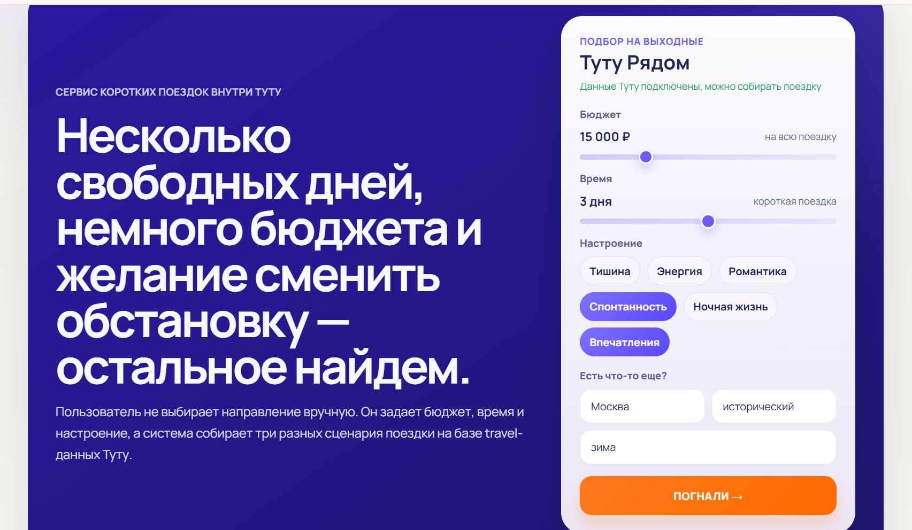
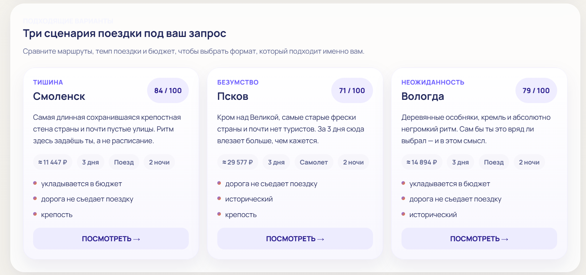
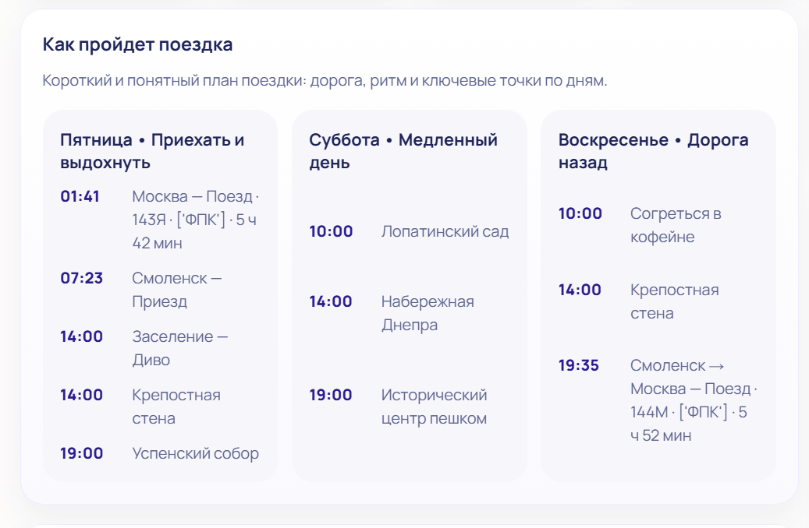

# Туту Рядом

`Туту Рядом` — продукт для ИИ-хакатона Туту 2026: сервис коротких поездок на базе Tutu MCP. Пользователь задает бюджет, длительность и настроение, а система собирает три готовых сценария поездки с понятным маршрутом, проживанием и доступными ссылками на оформление.

## Документация

- Подробная инструкция для пользователя: [docs/USER_GUIDE.md](docs/USER_GUIDE.md)
- Быстрый сценарий запуска и проверки для жюри: [docs/JURY_QUICKSTART.md](docs/JURY_QUICKSTART.md)

## Быстрый запуск

1. Установите зависимости:
   `pip install -r requirements.txt`
2. При необходимости скопируйте `.env.example` в `.env`
3. Запустите приложение:
   `uvicorn app.main:app --reload`
4. Откройте:
   `http://127.0.0.1:8000`

## Что умеет продукт

- подбирает поездку без ручного выбора направления;
- собирает три разных сценария под один запрос;
- объясняет, почему каждый вариант подходит;
- позволяет доработать уже выбранный маршрут;
- открывает корзину с доступными ссылками на оформление;
- не срывает демо в пустой экран, если источник данных временно нестабилен.

## Три варианта поездки

После ввода параметров сервис предлагает три готовых сценария поездки, чтобы пользователь мог быстро сравнить ритм, бюджет и формат дороги.

## План поездки

Для каждого выбранного варианта сервис показывает короткий и понятный план по дням: дорогу, ключевые точки и ритм поездки.

## Зачем это нужно

Сервис закрывает практический сценарий: пользователь хочет ненадолго выбраться из города, но не хочет вручную собирать билеты, проживание и общий план поездки. Вместо десятков шагов он получает короткий путь от идеи до готового маршрута.
